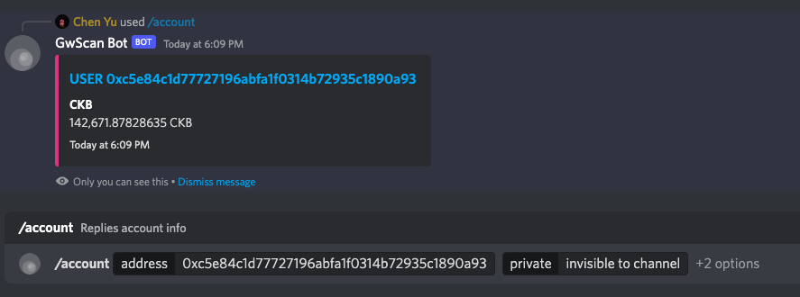
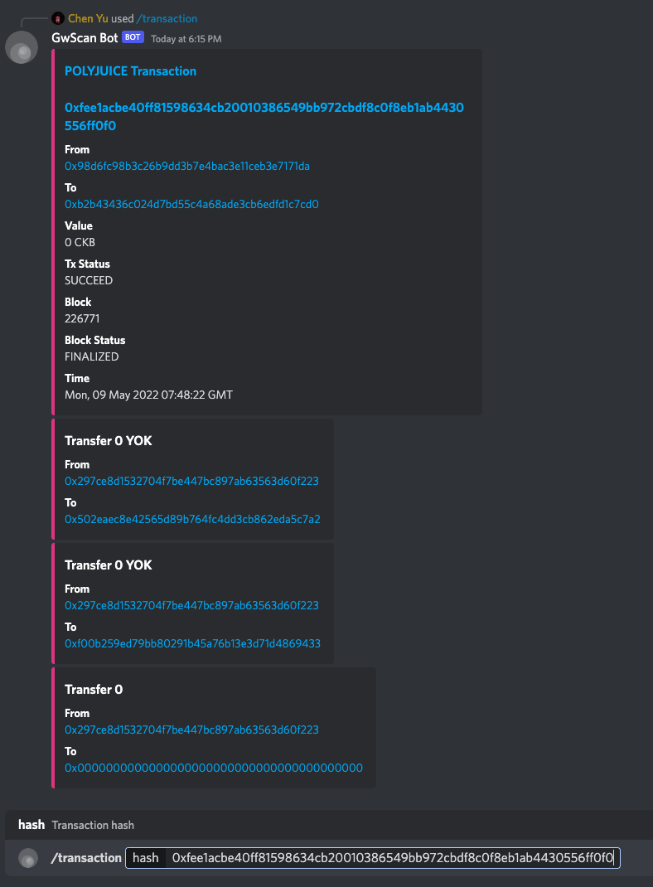

## Build a discord bot with GwScan Public API Service

### Introduction to GwScan Public API Service

[GwScan](https://www.gwscan.com/) is a blockchain explorer delivering data from Godwoken, backed by GwScan public API Service, a set of infrastructure to provide robust access to Godwoken, leaving developers to focus on their own products and to be a buidler.

### Why you should build your application based on GwScan Public API Service

GwScan Public API provides a set of well-grained APIs for DApp developers and concealed obscure concepts derived from Godwoken. It exposes APIs in GraphQL, which is more flexible and friendly for application development.

### Quickstart

We'll go through the entire progress of building a discord bot with discord.js(Discord JavaScript SDK) and GwScan Public API Service to get you started.

### Prerequisite

1. A container with node.js runtime to serve discord bot, you may find the installation guide in https://nodejs.org;

2. Discord developer account to authenticate your bot to discord servers. Specifically, we need
    - Discord bot token, discord bot token is a set of chars used in authorization for the bot to perform functions on Discord client. You should go to https://discord.com/developers/applications and create an application, and then generate a fresh token on configuring your bot;
    - Application id, also can be got in application's general information page, https://discord.com/developers/applications;
    - Guild id: right click your discord server used to debug the bot and copy its id.

3. A GwScan Public API service as a data source, you should deploy your own [GwScan](https://github.com/nervina-labs/godwoken_explorer) service. For convenience, we provide a public endpoint for godwoken v1.1 soon.

#### Begin by creating an empty project

We should create an empty directory to start our project

```sh
$ mkdir gwscan-bot && cd gwscan-bot && npm init -y
```

Commands above will create an initial npm project with a name the same as that of directory.

Our project will grow as follows,

```sh
.
├── README.md
├── lib # compiled files
├── node_modules # npm dependencies
├── package-lock.json # dependencies lock file
├── package.json # project configuration
├── src
│   ├── client.ts # graphql client used to request data from gwscan public api service
│   ├── commands
│   │   ├── account.ts # /account [address] [private or public message]
│   │   ├── index.ts
│   │   └── transaction.ts # /transaction [transaction hash]
│   ├── config.ts # project config, including discord bot token, application id, guild id
│   ├── deploy-commands.ts # code to register commands to discord
│   ├── index.ts
│   └── utils
│       ├── format.ts
│       └── index.ts
└── tsconfig.json # configuration of TypeScript
```

#### Add npm dependencies

```sh
$ npm install --save-exact @discordjs/builder @discordjs/rest  discord-api-types discord.js dotenv ts-node typescript bignumber.js graphql graphql-request
```

`@discordjs/builder`, `@discordjs/rest`, `discord-api-types` and `discord.js` are used to build discord commands;
`dotenv`, `ts-node` and `typescript` are used to debug and compile our project;
`bignumber.js`, `graphql` and `graphql-request` are used to build our main business logic.

#### Configure our project with typescript and npm scripts

Add typescript config in `tsconfig.json`

```json
{
  "compilerOptions": {
    "target": "es2016",
    "module": "commonjs",
    "rootDir": "./src",
    "outDir": "./lib",
    "esModuleInterop": true,
    "forceConsistentCasingInFileNames": true,
    "strict": true,
    "skipLibCheck": true
  }
}
```

We are going to add source code in `./src` and expect to compile it to `./lib`.

Add npm scripts in `package.jsno` to facilitate our work

```json
{
  "scripts": {
    "dev": "ts-node src/index.ts",
    "deploy": "ts-node src/deploy-commands",
    "build": "tsc"
  }
}
```

#### Import discord bot token and application id and guild id via dotenv

Add an environment variable file `.env` with the following content,

```sh
SERVER= # GwScan Public API Service Endpoint
DISCORD_TOKEN= # Discord bot token
APP_ID= # application id
GUILD_ID= # guild id
```

Create `src/config.ts` and fill the following codes, it reads config from `.env`

```typescript
import 'dotenv/config'

export const config = {
  token: process.env.DISCORD_TOKEN,
  publicKey: process.env.PUBLIC_KEY,
  server: process.env.SERVER,
  appId: process.env.APP_ID,
  guildId: process.env.GUILD_ID,
}

export const LOGO_URL = 'https://www.gwscan.com/icons/nervina-logo.svg'
export const GWSCAN_URL = 'https://www.gwscan.com'
export const CKB_DECIMALS = 8
export const PRIMARY_COLOR = '#E03C8A'
```

#### Create a graphql client object to fetch data from GwScan Public API Service

Create `src/client.ts`

```typescript
import { GraphQLClient } from "graphql-request";
import { config } from './config'

if (!config.server) {
  throw new Error(`Server url is required in GraphQL client`)
}

export const client = new GraphQLClient(config.server, { headers: { 'Accept': 'application/json' } })
```

#### Create commands

We will create two commands in this guide, `/account` and `/transaction`, to fetch basic info of a specific account or transaction as follows,



##### Create account command

```typescript
// ./src/commands/account.ts

import { CacheType, CommandInteraction, MessageEmbed } from 'discord.js'
import { SlashCommandBuilder } from '@discordjs/builders'
import { gql } from 'graphql-request'
import { client } from '../client'
import { formatValue } from '../utils'
import { LOGO_URL, GWSCAN_URL, PRIMARY_COLOR } from '../config'

const query = gql`
    query($address: String!) {
      account(input: {address: $address}) {
        id
        eth_address
        type
        transaction_count
        token_transfer_count
        nonce
        account_udts {
          balance
          udt {
            id
            icon
            decimal
            name
            type
            symbol
          }
        }
      }
    }
  `

export const data = new SlashCommandBuilder()
  .setName('account')
  .setDescription('Replies account info')
  .addStringOption(option =>
    option.setName('address')
      .setDescription('Account eth address')
      .setRequired(true))
  .addStringOption(option =>
    option.setName('private')
      .setDescription('Set visibility of this message')
      .addChoices(
        { name: 'invisible to channel', value: 'true' },
        { name: 'visible to channel', value: 'false' }
      )
  )

export const execute = async (intereaction: CommandInteraction<CacheType>) => {
  const address = intereaction.options.getString('address')
  const isInvisible = intereaction.options.getString('private') === 'true'
  const { account } = await client.request(query, { address })

  if (!account) return intereaction.reply({ content: `Account "${address}" not found`, ephemeral: true })

  const embed = new MessageEmbed()
    .setColor(PRIMARY_COLOR)
    .setImage(LOGO_URL)
    .setThumbnail(LOGO_URL)
    .setTitle(`${account.type} ${account.eth_address}`)
    .setURL(`${GWSCAN_URL}/address/${account.eth_address}`)
    .addFields(
      account.account_udts.map((u: any) => ({
        name: u.udt.name || 'Unknown',
        value: formatValue(u.balance, u.udt?.decimal, u.udt?.symbol),
        inline: true,
      }))
    )
    .setTimestamp()

  return intereaction.reply({ embeds: [embed], ephemeral: isInvisible })
}
```

There are 3 points to be noted,

1. Declare a graphql query `query` to fetch account info

```typescript
const query = gql`
    query($address: String!) {
      account(input: {address: $address}) {
        id
        eth_address
        type
        transaction_count
        token_transfer_count
        nonce
        account_udts {
          balance
          udt {
            id
            icon
            decimal
            name
            type
            symbol
          }
        }
      }
    }
  `
```

It is a composable query based on schema designed in GwScan Public API Service and flexible for various applications, you can inspect the schema in [schema.graphql](https://github.com/Magickbase/godwoken_explorer/blob/main/docs/schema.graphql), or view it with a graphql explorer connected to the service.

Here we query the basic fields of an account and get a response as follows,

```json
{
 "data": {
  "account": {
   "account_udts": [
    {
     "balance": "204989529153",
     "udt": {
      "decimal": 8,
      "icon": "https://cryptologos.cc/logos/nervos-network-ckb-logo.svg?v=022",
      "id": "1",
      "name": "CKB",
      "symbol": "CKB",
      "type": "BRIDGE"
     }
    }
   ],
   "eth_address": "0x387a3cb79141324c25ec4ea3c9b267b550c7fbdc",
   "id": 30690,
   "nonce": 340302,
   "token_transfer_count": 414290,
   "transaction_count": 340250,
   "type": "USER"
  }
 }
}
```

2. register a slash command of discord bot

```typescript
export const data = new SlashCommandBuilder()
  .setName('account')
  .setDescription('Replies account info')
  .addStringOption(option =>
    option.setName('address')
      .setDescription('Account eth address')
      .setRequired(true))
  .addStringOption(option =>
    option.setName('private')
      .setDescription('Set visibility of this message')
      .addChoices(
        { name: 'invisible to channel', value: 'true' },
        { name: 'visible to channel', value: 'false' }
      )
  )
```

3. add handler of the slash command

```typescript
export const execute = async (intereaction: CommandInteraction<CacheType>) => {
  const address = intereaction.options.getString('address')
  const isInvisible = intereaction.options.getString('private') === 'true'
  const { account } = await client.request(query, { address })

  if (!account) return intereaction.reply({ content: `Account "${address}" not found`, ephemeral: true })

  const embed = new MessageEmbed()
    .setColor(PRIMARY_COLOR)
    .setImage(LOGO_URL)
    .setThumbnail(LOGO_URL)
    .setTitle(`${account.type} ${account.eth_address}`)
    .setURL(`${GWSCAN_URL}/address/${account.eth_address}`)
    .addFields(
      account.account_udts.map((u: any) => ({
        name: u.udt.name || 'Unknown',
        value: formatValue(u.balance, u.udt?.decimal, u.udt?.symbol),
        inline: true,
      }))
    )
    .setTimestamp()

  return intereaction.reply({ embeds: [embed], ephemeral: isInvisible })
}
```

Let's do the same work for a transaction command,

```typescript
import { CacheType, CommandInteraction, EmbedFieldData, MessageEmbed } from 'discord.js'
import { SlashCommandBuilder } from '@discordjs/builders'
import { gql } from 'graphql-request'
import { client } from '../client'
import { formatValue } from '../utils'
import { LOGO_URL, GWSCAN_URL, CKB_DECIMALS, PRIMARY_COLOR } from '../config'

const query = gql`
    query ($hash: String!) {
      transaction(input: { transaction_hash: $hash }) {
        hash
        from_account {
          eth_address
        }
        to_account {
          eth_address
        }
        type
        polyjuice {
          value
          status
          input
        }
        block {
          number
          hash
          timestamp
          status
        }
      }

      token_transfers(input: { transaction_hash: $hash }) {
        amount
        from_address_hash
        to_address_hash
        udt {
          id
	  decimal
          symbol
        }
      }
    }
  `

export const data = new SlashCommandBuilder()
  .setName('transaction')
  .setDescription('Replies transaction info')
  .addStringOption(option =>
    option.setName('hash')
      .setDescription('Transaction hash')
      .setRequired(true))

export const execute = async (intereaction: CommandInteraction<CacheType>) => {
  const hash = intereaction.options.getString('hash')
  const { transaction, token_transfers } = await client.request(query, { hash })

  if (!transaction) return intereaction.reply({ content: `Transaction "${hash}" not found`, ephemeral: true })

  const fields = [
    { name: 'From', value: `[${transaction.from_account.eth_address}](${GWSCAN_URL}/address/${transaction.from_account.eth_address})` },
    { name: 'To', value: `[${transaction.to_account.eth_address}](${GWSCAN_URL}/address/${transaction.to_account.eth_address})` },
    transaction.polyjuice ? { name: 'Value', value: formatValue(transaction.polyjuice.value ?? '0', CKB_DECIMALS, 'CKB') } : null,
    transaction.polyjuice ? { name: 'Tx Status', value: transaction.polyjuice.status } : null,
    { name: 'Block', value: `${transaction.block?.number ?? '-'}` },
    { name: 'Block Status', value: transaction.block?.status ?? '-' },
    { name: "Time", value: transaction.block?.timestamp ? new Date(transaction.block.timestamp).toUTCString() : '-' },
  ].filter(v => v) as Array<EmbedFieldData>

  const embeds = [new MessageEmbed()
    .setColor(PRIMARY_COLOR)
    .setImage(LOGO_URL)
    .setThumbnail(LOGO_URL)
    .setTitle(`${transaction.type} Transaction\n ${transaction.hash}`)
    .setURL(`${GWSCAN_URL}/tx/${transaction.hash}`)
    .addFields(...fields),

  ...(token_transfers.map((t: any) => (
    new MessageEmbed()
      .setColor(PRIMARY_COLOR)
      .setTitle(`Transfer ${formatValue(t.amount, t.udt?.decimal, t.udt?.symbol)}`)
      .setFields(
        { name: 'From', value: t.from_address_hash ? `[${t.from_address_hash}](${GWSCAN_URL}/address/${t.from_address_hash})` : '-' },
        { name: 'To', value: t.to_address_hash ? `[${t.to_address_hash}](${GWSCAN_URL}/address/${t.to_address_hash})` : '-' }
      )
  )))
  ]

  return intereaction.reply({ embeds })
}
```

Thanks to composability of graphql, we can request transaction info and its internal transfers in a single command.

```typescript
const query = gql`
    query ($hash: String!) {
      transaction(input: { transaction_hash: $hash }) {
        hash
        from_account {
          eth_address
        }
        to_account {
          eth_address
        }
        type
        polyjuice {
          value
          status
          input
        }
        block {
          number
          hash
          timestamp
          status
        }
      }

      token_transfers(input: { transaction_hash: $hash }) {
        amount
        from_address_hash
        to_address_hash
        udt {
          id
					decimal
          symbol
        }
      }
    }
  `
```

Expose these two commands in the module by

```typescript
// src/commands/index.ts
export * as account from './account'
export * as transaction from './transaction'
```

**We are almost there!**

#### Register our commands of the bot

Create the script and run `npm run deploy` to call the npm script listed in the package.json.

```typescript
import { REST } from '@discordjs/rest'
import { Routes } from 'discord-api-types/v9'
import { config } from './config'
import * as cmds from './commands'

const rest = new REST({ version: '9' }).setToken(config.token!)
const commands = Object.values(cmds).map(c => c.data.toJSON())

rest.put(Routes.applicationGuildCommands(config.clientId!, config.guildId!), { body: commands })
  .then(() => console.log("Deployed commands successfully"))
  .catch(console.error)
```

After this step, our bot will prompt user with registered commands when they type `/account` or `/transaction`.

#### Deploy our bot

Once commands are registered, we should deploy our bot to handle requests from users.

Let's add an entry of our program

```typescript
// src/index.ts

import { Client, Intents, Collection, CommandInteraction, CacheType } from 'discord.js'
import { config } from './config'
import * as cmds from './commands'
import { SlashCommandBuilder } from '@discordjs/builders'

const client = new Client({ intents: [Intents.FLAGS.GUILDS] })

client.once('ready', () => {
  console.log('Ready')
})

const commands = new Collection<string, { data: Omit<SlashCommandBuilder, "addSubcommandGroup" | "addSubcommand">, execute: (i: CommandInteraction<CacheType>) => Promise<void> }>()

// cache all commands and their callback in `commands` map
Object.entries(cmds).forEach(([name, value]) => commands.set(name, value))

client.on('interactionCreate', async (interaction) => {
  if (!interaction.isCommand()) return

  const command = commands.get(interaction.commandName)
  if (!command) return

  try {
    // handle requests from users
    await command.execute(interaction)
  } catch (err) {
    console.error(err)
    await interaction.reply({
      content: `There was an error on executing this command`, ephemeral: true
    })
  }
})

client.login(config.token)
```

Now, we can try the bot by running it in dev mode `npm run dev`. Once it's up, you can type `/account` or `/transaction` in your develop discord server where bot has been invited into and wait for the response.
